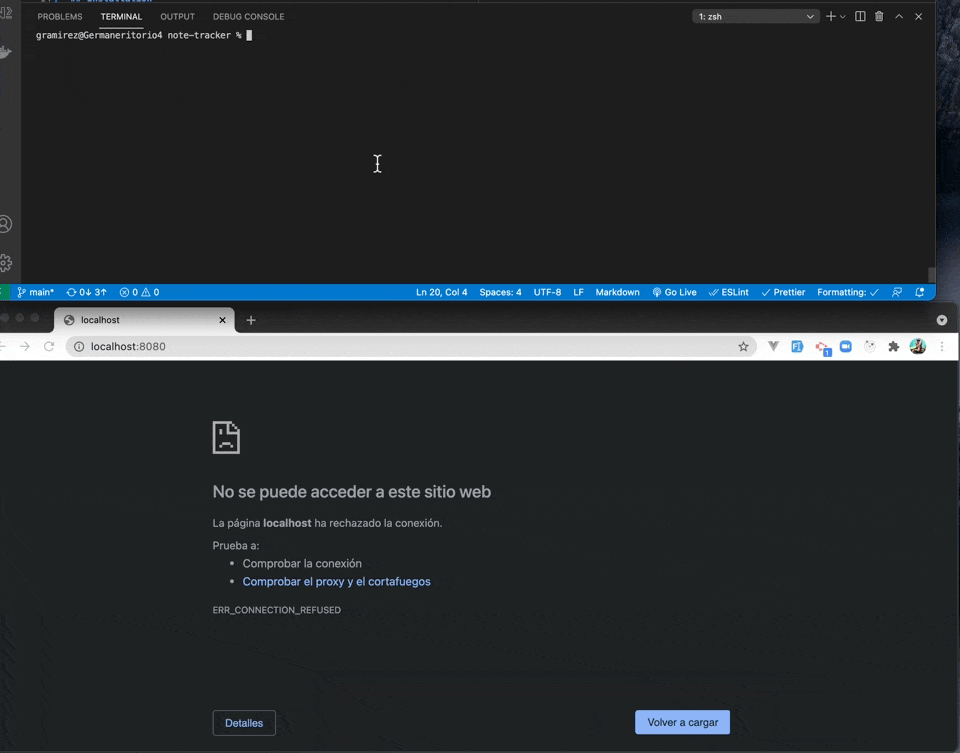

# Note Tracker


This project can help us to track our notes and have it on a web enviroment so we can use it at anytime

## Table of Contents

- [Installation](#installation)
- [Usage](#usage)
- [License](#license)
- [Questions](#questions)

## Installation

Use the package manager [npm](https://docs.npmjs.com/cli/v7/commands/npm-install) to install all the dependencies that are on the package.json

```bash
npm install
```

## Usage

To Run the system you need to use the follow command

```bash
npm start
```

This will trigger the app so it can start the server



## License

This project is licensed under the MIT license.

## [Note Tracker GitHub Code](https://github.com/izaack89/note-tracker)

## [Note Tracker Live Server](https://powerful-scrubland-38710.herokuapp.com/)

## Note Tracker References

- [uuid](https://www.npmjs.com/package/uuid) - uuid Information
- [read Json](https://stackoverflow.com/questions/10011011/using-node-js-how-do-i-read-a-json-file-into-server-memory) - Read Json File

## Questions

If you have any questions about the repository, open an issue or contact me directly at mitsuominagi@gmail.com. You can find more of my work at [izaack89](https://github.com/izaack89)

## Author

- **German Ramirez** - [GitHub](https://github.com/izaack89/)


